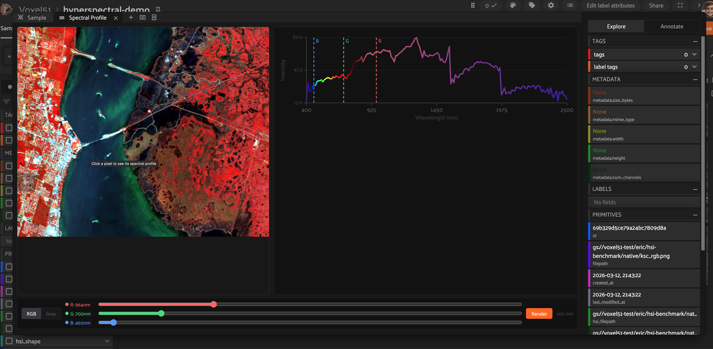
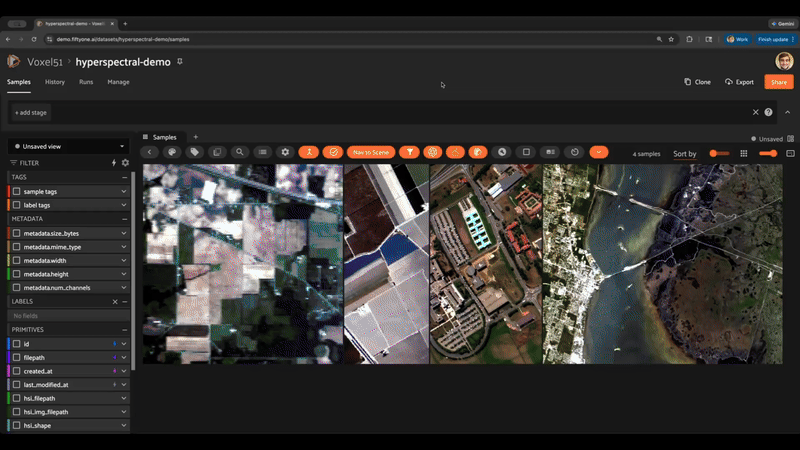

# ENVI Spectral Viewer

A [FiftyOne](https://github.com/voxel51/fiftyone) plugin for exploring hyperspectral imagery in ENVI format. Click any pixel on a hyperspectral image to instantly plot its full spectral signature — reflectance vs. wavelength — in an interactive side panel. Supports custom RGB band rendering to explore the data from different spectral perspectives.





## Overview

[ENVI](https://www.nv5geospatialsoftware.com/Products/ENVI) is the standard file format for hyperspectral and multispectral imagery in remote sensing and scientific imaging. Each ENVI dataset consists of a plain-text `.hdr` header file paired with a flat binary image cube containing hundreds of spectral bands per pixel.

This plugin lets you:

- **Click any pixel** on a hyperspectral image to plot its full spectral profile (reflectance vs. wavelength)
- **Re-render the RGB composite** by dragging sliders to map any three bands to R, G, B
- Works with **local and cloud-hosted** ENVI files (S3, GCS, Azure via FiftyOne Enterprise)
- Zero required dependencies — uses a built-in ENVI BIL reader; install [`spectral`](https://www.spectralpython.net/) for full BSQ/BIP/compressed format support

## Installation

```shell
fiftyone plugins download https://github.com/ehofesmann/envi-spectral-viewer
```

**Optional** — install the `spectral` package for full ENVI format support (BSQ, BIP, compressed):

```shell
pip install spectral
```

Without `spectral`, the plugin supports BIL-interleaved ENVI files (the most common format). Attempting to open a BSQ or BIP file without `spectral` installed will raise a clear error with install instructions.

> **FiftyOne Enterprise users:** See the [custom plugins documentation](https://github.com/voxel51/fiftyone-teams-app-deploy/blob/main/docs/custom-plugins.md) for how to make additional Python packages like `spectral` available to your deployment.

## Requirements

| Requirement | Notes |
|---|---|
| `fiftyone` | Core framework |
| `numpy` | Included with FiftyOne |
| `Pillow` | Required for RGB re-rendering |
| `spectral` *(optional)* | Full ENVI format support (BSQ/BIP) |

## Sample structure

Each FiftyOne sample must have the following fields:

| Field | Type | Description |
|---|---|---|
| `filepath` | `StringField` | Path to a display image (PNG/JPEG) — typically a pseudo-RGB render of the cube |
| `hsi_filepath` | `StringField` | Path to the ENVI `.hdr` header file |
| `hsi_img_filepath` | `StringField` | Path to the ENVI binary data file (`.img`, `.dat`, etc.) |
| `hsi_shape` | `ListField` | `[rows, cols, bands]` — shape of the hyperspectral cube |
| `hsi_scale_factor` | `IntField` | Upscale factor between the display image and the ENVI cube (e.g. `4` if the PNG is 4× upscaled) |
| `wavelengths` | `ListField` | List of wavelength values in nm, one per band |

## Quickstart

A synthetic demo dataset generator is included in the `data/` directory. It creates a 512×512×200-band ENVI scene with four spectral regions (water, vegetation, soil, urban) and loads it into FiftyOne:

```shell
pip install fiftyone numpy Pillow
python data/create_synthetic_dataset.py
```

Then launch FiftyOne:

```python
import fiftyone as fo

dataset = fo.load_dataset("envi-synthetic-demo")
fo.launch_app(dataset)
```

Open any sample in the modal, then open the **Spectral Profile** panel. Click a pixel to see its spectral signature plotted immediately.

## Usage

### Spectral profile

1. Open a sample in the modal
2. Open the **Spectral Profile** panel from the panel selector
3. Click any pixel on the image — the spectral plot updates instantly

### RGB band rendering

In the Spectral Profile panel, use the **R / G / B sliders** to select which bands map to each channel, then click **Render** to update the displayed image.

## Loading your own ENVI data

```python
import fiftyone as fo

dataset = fo.Dataset(name="my-hsi-dataset", persistent=True)

sample = fo.Sample(
    filepath="/path/to/display.png",       # pseudo-RGB render
    hsi_filepath="/path/to/scene.hdr",
    hsi_img_filepath="/path/to/scene.img",
    hsi_shape=[512, 512, 224],             # [rows, cols, bands]
    hsi_scale_factor=1,
    wavelengths=[400.0, 410.0, ...],       # one value per band
)

dataset.add_sample(sample)
fo.launch_app(dataset)
```

## Operators

| Operator | Description |
|---|---|
| `get_spectral_profile` | Reads a pixel's spectral signature from the ENVI cube and sends it to the panel |
| `render_rgb_image` | Re-renders the display image using user-selected band indices |
| `load_hsi_image` | Loads the display image and sends wavelength metadata to the panel |
| `show_hsi_data` | JS operator — receives data from Python and updates panel state |

## Cloud support

For cloud-hosted ENVI files (S3, GCS, Azure), the plugin:

1. Uses **FiftyOne Enterprise media cache** when available — handles download deduplication and cache eviction automatically
2. Falls back to downloading to a local temp directory for non-Teams installs with cloud paths

Local files are passed through with zero overhead.
